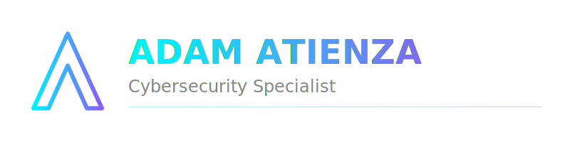

# Adam Atienza

I build secure systems and research how they fail. My work sits at the intersection of software development and defensive operations, with a focus on identity management, network security, and file system integrity.

I value operational reliability: clear, battle-tested security logic over theoretical best practices. Currently, I am focusing on web defense and protecting data at rest without sacrificing usability.

[Full portfolio at ItsAdam01.github.io](https://ItsAdam01.github.io)

## Featured Projects

### Lynx: File Integrity Monitor
A host-based IDS built in Go for real-time file system monitoring and cryptographic verification using HMAC-SHA256. [View Repository](https://github.com/ItsAdam01/Lynx)

### Network Intrusion Detection & WAF
A dual-layer security dashboard combining Scapy-based network sniffing with application-level filtering to detect external threats. [View Repository](https://github.com/ItsAdam01/Network-Intrusion-Detection)

### Sentinel Vault: IAM PoC
An identity management project focused on OAuth 2.0 audit trails and session anomaly detection through high-fidelity telemetry. [View Repository](https://github.com/ItsAdam01/Sentinel-Vault)

### Resort Booking Security Hardening
Production hardening for a booking engine, featuring a Blind Indexing pattern to secure PII while maintaining search functionality. [View Repository](https://github.com/blueship-tech/resort-booking)

## Technical Skills

- Security Operations: WAF tuning, Identity & Access Management (IAM), PII
  protection, DPA compliance.
- Languages: Go, Python, TypeScript, JavaScript.
- Tools: Next.js, Payload CMS, Docker, Scapy, Prisma, PostgreSQL, SQLite.

## Contact

- Email: adamatnza01@gmail.com
- Portfolio: ItsAdam01.github.io

I am always looking for complex security problems that require deep research and
practical solutions. Reach out if you want to discuss security or collaborate on
a project.
